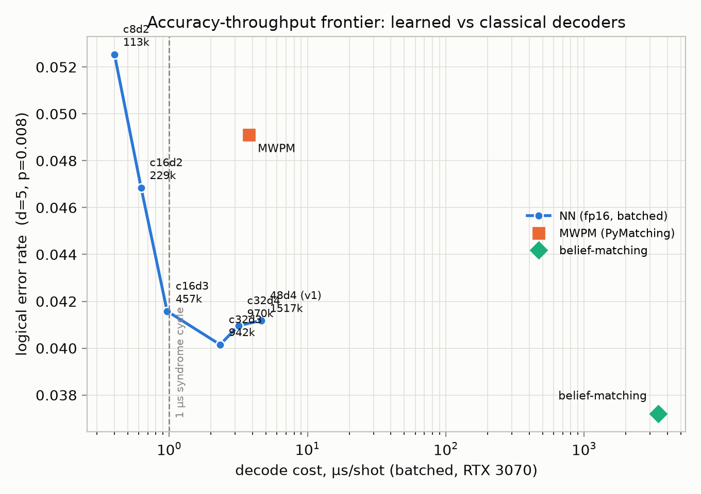
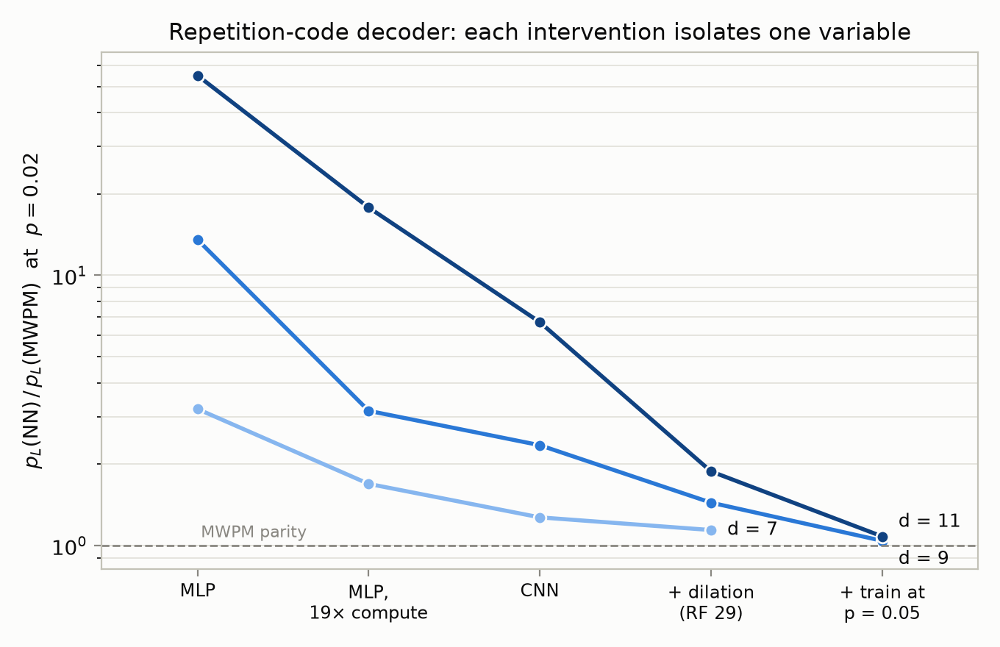

# qec-neural-decoder

Neural-network decoders for quantum error correction, benchmarked against
minimum-weight perfect matching (MWPM) and belief-matching on identical shots,
with decode latency treated as a first-class metric. All experiments run on
consumer hardware (RTX 3070 / RTX 5050, 8 GB each); every reported number is
reproducible from a seeded config committed in `experiments/`.

**Main result.** On the distance-5 rotated surface code under circuit-level
depolarizing noise, a 229k-parameter convolutional decoder (fp16) reaches a
lower logical error rate than MWPM at six times MWPM's throughput —
0.63 µs/shot batched, inside the ~1 µs syndrome-cycle budget — while the
classical decoder that matches the network's accuracy (belief-matching) costs
3.4 ms/shot, three orders of magnitude over budget.



*MWPM is Pareto-dominated by the mid-sized networks; belief-matching holds a
small accuracy lead at a ~1500–5500× throughput cost. NN latencies: RTX 3070,
fp16, batch 8192. Classical decoders: i9-9900. Test sets: 100k shots at
p = 0.008, identical across decoders.*

## Results

### Surface code accuracy (d = 3, 5; circuit-level noise)

Logical error rate per shot, paired million-shot test sets. NN is a 3D CNN
over the (check-type, time, space) syndrome volume, trained at p = 0.008 and
evaluated across p without retraining.

| d | p | NN | MWPM | belief-matching | NN/MWPM | NN/BM |
|---|------|--------|--------|--------|------|------|
| 3 | 0.004 | 9.48e-3 | 1.14e-2 | 1.04e-2 | 0.83 | 0.92 |
| 3 | 0.006 | 2.06e-2 | 2.36e-2 | 2.19e-2 | 0.87 | 0.94 |
| 3 | 0.008 | 3.55e-2 | 4.02e-2 | 3.75e-2 | 0.88 | 0.95 |
| 5 | 0.004 | 5.34e-3 | 7.59e-3 | 5.29e-3 | 0.70 | 1.01 |
| 5 | 0.006 | 1.75e-2 | 2.31e-2 | 1.65e-2 | 0.76 | 1.07 |
| 5 | 0.008 | 4.08e-2 | 4.93e-2 | 3.70e-2 | 0.83 | 1.10 |

The network beats plain MWPM at every operating point (the correlated errors
introduced by syndrome-extraction circuits violate matching's independence
assumption), beats belief-matching at d = 3, and is between the two classical
decoders at d = 5. A 2× capacity scale-up at d = 5 overfits and evaluates
worse (`docs/phase2-results.md`).

### Model-size ladder and latency (d = 5, p = 0.008)

| decoder | params | p_L | µs/shot (batched) | single-shot median |
|---|---|---|---|---|
| NN c8d2, fp16 | 113k | 0.0525 | 0.40 | — |
| NN c16d2, fp16 | 229k | 0.0469 | 0.63 | 70 µs (CUDA graph) |
| NN c16d3, fp16 | 457k | 0.0416 | 0.96 | 91 µs |
| NN c32d3, fp16 | 942k | 0.0401 | 2.33 | 103 µs |
| MWPM (PyMatching 2) | — | 0.0491 | 3.78 | 7.8 µs |
| belief-matching (20 BP iters) | — | 0.0372 | 3437 | — |

Accuracy saturates near 1M parameters. fp16 and int8 weight quantization are
both accuracy-neutral (Δp_L < 1% relative). Single-shot GPU latency is
dominated by fixed host-device overhead (~70 µs with CUDA graphs, vs. ~0.6 µs
of arithmetic): the batched numbers describe a streaming/windowed decoding
regime, and the ~100× overhead-to-compute ratio quantifies the case for
persistent-kernel or FPGA implementations. Details: `docs/phase3-results.md`.

### How the architecture was arrived at (repetition code, d ≤ 11)

Phase 1 develops the decoder on the repetition code with one intervention per
step, each isolating a single variable:



A flat MLP fails to scale with distance and cannot be rescued by compute
(19× training budget improves d = 11 from 55× to 17.8× worse than MWPM).
Convolutional locality recovers most of the gap; extending the receptive
field past the longest error chain (dilated kernels, RF 29 > d = 11 chains)
and training where logical errors are plentiful (p = 0.05, evaluated at low
p) close the remainder to within 8% of MWPM everywhere, ahead at several
operating points. Full tables: `docs/phase1-results.md`.

### Negative results and training pathologies

Documented deliberately, with artifacts:

- Capacity does not substitute for inductive bias (MLP scaling wall), and
  excess capacity harms generalization (d = 5 scale-up overfit).
- A deterministic, data-seed-dependent training collapse: one Stim sample
  stream drives the fresh network to constant base-rate output within the
  first epoch (loss frozen at exactly H(base rate)), surviving GroupNorm and
  gradient clipping, with healthy marginal statistics. Six candidate causes
  were falsified experimentally before isolating the trigger; 500-step linear
  LR warmup eliminates it. `docs/phase2-results.md` has the investigation.

## Methods

- **Circuits and sampling:** Stim generated circuits (`repetition_code:memory`,
  `surface_code:rotated_memory_z`), circuit-level depolarizing noise, r = d
  rounds. Detection events sampled to uint8, held on-device.
- **Baselines:** PyMatching 2 on the decomposed detector error model;
  belief-matching (BP on the full DEM + matching) as the correlation-aware
  classical reference. Threshold curves reproduce published MWPM results
  (surface-code crossing at p ≈ 0.007; `docs/figures/phase0_*.png`).
- **Evaluation:** every NN–classical comparison uses identical test shots;
  artifacts record paired disagreement counts (`nn_only_wrong`,
  `mwpm_only_wrong`) for significance assessment. Test sets are 10^5–10^6
  shots; at the smallest reported rates the rarer outcome exceeds 500 events.
- **Provenance:** each run serializes its config, seeds, and git SHA into its
  artifact. Figures are generated by committed scripts from committed
  artifacts.

## Limitations

Simulated depolarizing noise only, d ≤ 5 for the surface code, and batched
throughput is not reactive single-shot latency (see above). The ladder's
claim-bearing configurations were retrained under three seeds each: seed
spread is ±1–3% relative — an order of magnitude below the reported effects —
with every seed beating MWPM at every operating point
(`docs/phase3-results.md`). Validation on public experimental data (Google
surface-code memory datasets) is planned.

## Repository layout

```
src/qecdec/      circuits, sampling, representation, models, training,
                 paired evaluation, latency benchmarks
experiments/     seeded configs + JSON result artifacts (one per run)
docs/            phase writeups (phase1/2/3-results.md), figures, notation primer
tests/           pytest suite (physics invariants, mappings, training smoke)
scripts/         figure generation, workstation orchestration
```

## Reproducing

```bash
python -m venv .venv && source .venv/bin/activate
pip install -e ".[dev]"            # + torch (cu128 wheels for GPU, or cpu)
pytest                             # invariant checks, ~3 s
python -m qecdec.collect --config experiments/phase0_surface.json   # thresholds
python -m qecdec.train   --config experiments/phase2_surface_cnn3d.json --device cuda:0
python -m qecdec.compare_baselines --config experiments/phase2_surface_cnn3d.json
```

Training runs reported here took minutes (repetition code) to ~1 day (d = 5
surface code, 15M shots) on an RTX 5050.
